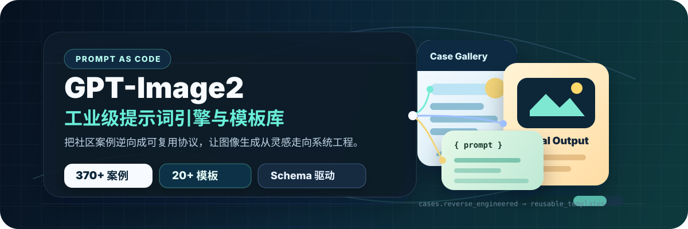
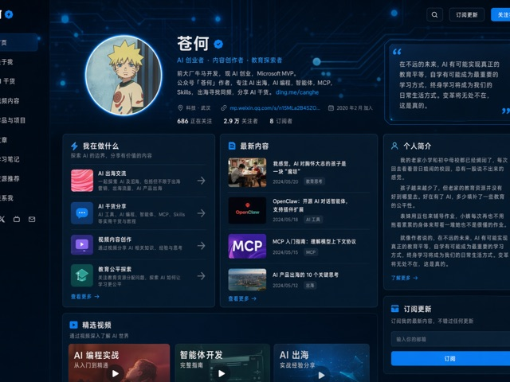
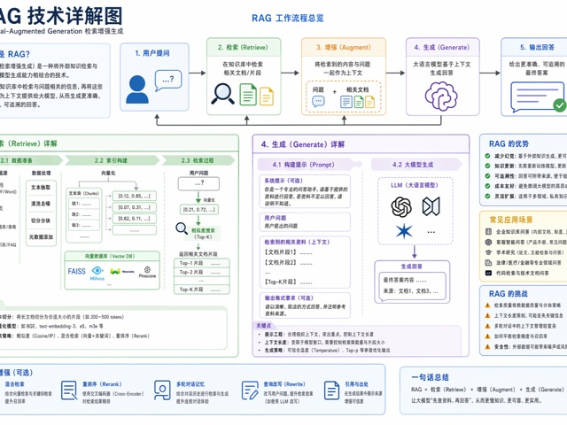
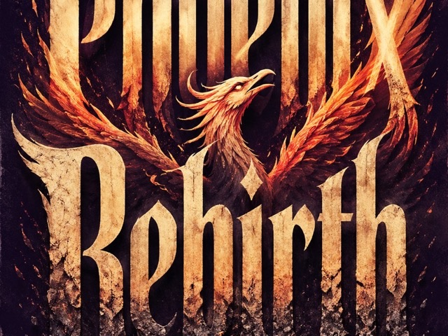
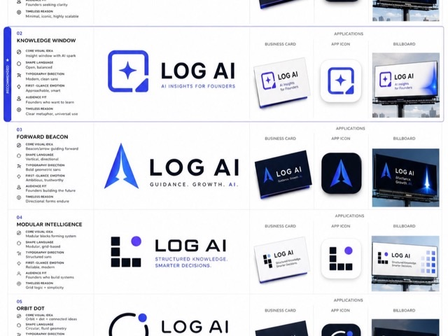
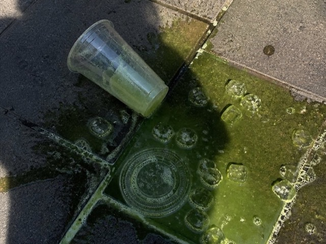
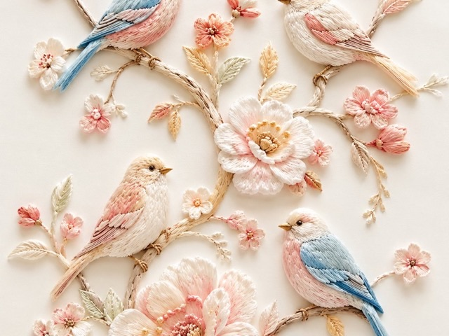
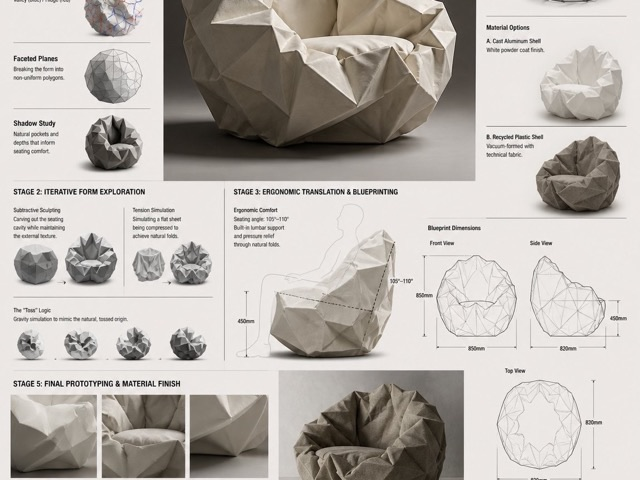
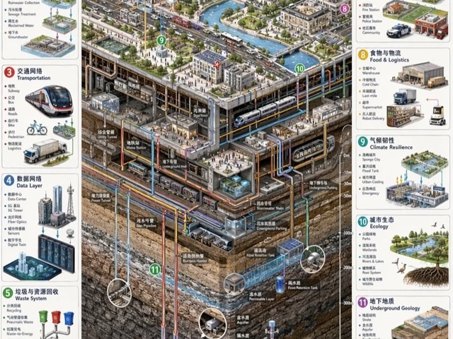

<p align="center"></p>

<h3 align="center">GPT-Image 提示词画廊与生成器 | 由 XidaoAPI 驱动</h3>

<p align="center">
  <a href="https://github.com/eddielueng/gptimage"></a>
  <a href="https://github.com/eddielueng/gptimage"></a>
  <a href="https://xidaoapi.com"></a>
</p>

<p align="center">
  <a href="./README.md">English</a> | <strong>简体中文</strong>
</p>

> 浏览 400+ GPT-Image 提示词案例，填入你自己的 API Key，直接生成图片。
> 基于 [freestylefly](https://github.com/freestylefly) 的 [awesome-gpt-image-2](https://github.com/freestylefly/awesome-gpt-image-2) 项目定制。

## 功能特色

- **自带 API Key** — 在 [XidaoAPI.com](https://xidaoapi.com) 注册获取 API Key，填入后直接用自己的额度生图
- **邮箱 & Google 登录** — 支持邮箱密码注册登录，也支持 Google 快捷登录
- **模型选择器** — 可选 `gpt-image`、`gpt-image-2`、`gpt-image-2-c`
- **400+ 提示词案例** — 涵盖 12 个分类，可浏览和复制结构化提示词
- **20+ 工业级模板** — 各类场景的提示词模板
- **本地收藏与历史** — 无需后端也能使用，数据保存在浏览器中

## 快速开始

### 1. 获取 API Key

访问 [XidaoAPI.com](https://xidaoapi.com) 注册账号并获取 API Key。

### 2. 部署或本地运行

```bash
# 克隆仓库
git clone https://github.com/eddielueng/gptimage.git
cd gptimage
npm install

# 复制环境变量文件并填写
cp .env.example .env

# 本地运行
npm run dev
```

### 3. 配置环境变量

`.env` 中的关键配置：

```bash
# Supabase（用于登录认证）
VITE_SUPABASE_URL=
VITE_SUPABASE_ANON_KEY=
SUPABASE_SERVICE_ROLE_KEY=

# 管理员邮箱（逗号分隔）
VITE_SUPER_ADMIN_EMAILS=
SUPER_ADMIN_EMAILS=

# 图片生成 API
CIYUAN_BASE_URL=https://hk.xidaoapi.com
IMAGE_MODEL=gpt-image-2

# 应用 URL
APP_URL=http://localhost:5173
```

完整变量列表见 [.env.example](.env.example)。

### 4. 初始化 Supabase 数据库

在 Supabase SQL Editor 中执行 [supabase/combined_migration.sql](supabase/combined_migration.sql)。

## 分类概览

<table>
  <tr>
    <td width="33%" valign="top" align="center">
      <p><strong>UI 与界面</strong></p>
      <a href="docs/gallery.md#cat-ui"></a><br>
      <a href="docs/gallery.md#cat-ui"><strong>查看案例</strong></a>
    </td>
    <td width="33%" valign="top" align="center">
      <p><strong>图表与信息可视化</strong></p>
      <a href="docs/gallery.md#cat-infographic"></a><br>
      <a href="docs/gallery.md#cat-infographic"><strong>查看案例</strong></a>
    </td>
    <td width="33%" valign="top" align="center">
      <p><strong>海报与排版</strong></p>
      <a href="docs/gallery.md#cat-poster"></a><br>
      <a href="docs/gallery.md#cat-poster"><strong>查看案例</strong></a>
    </td>
  </tr>
  <tr>
    <td width="33%" valign="top" align="center">
      <p><strong>商品与电商</strong></p>
      <a href="docs/gallery.md#cat-product"></a><br>
      <a href="docs/gallery.md#cat-product"><strong>查看案例</strong></a>
    </td>
    <td width="33%" valign="top" align="center">
      <p><strong>品牌与标志</strong></p>
      <a href="docs/gallery.md#cat-brand"></a><br>
      <a href="docs/gallery.md#cat-brand"><strong>查看案例</strong></a>
    </td>
    <td width="33%" valign="top" align="center">
      <p><strong>摄影与写实</strong></p>
      <a href="docs/gallery.md#cat-photo"></a><br>
      <a href="docs/gallery.md#cat-photo"><strong>查看案例</strong></a>
    </td>
  </tr>
  <tr>
    <td width="33%" valign="top" align="center">
      <p><strong>插画与艺术</strong></p>
      <a href="docs/gallery.md#cat-illustration"></a><br>
      <a href="docs/gallery.md#cat-illustration"><strong>查看案例</strong></a>
    </td>
    <td width="33%" valign="top" align="center">
      <p><strong>建筑与空间</strong></p>
      <a href="docs/gallery.md#cat-architecture"></a><br>
      <a href="docs/gallery.md#cat-architecture"><strong>查看案例</strong></a>
    </td>
    <td width="33%" valign="top" align="center">
      <p><strong>完整画廊</strong></p>
      <a href="docs/gallery.md"></a><br>
      <a href="docs/gallery.md"><strong>进入画廊</strong></a>
    </td>
  </tr>
</table>

## 快速入口

- [完整案例总览](docs/gallery.md)
- [工业级提示词模板](docs/templates.md)
- [Agent Skill：GPT-Image 风格库](agents/skills/gpt-image-2-style-library/SKILL.md)
- [MIT 开源协议](LICENSE)

## 致谢与引用

本项目基于 [freestylefly](https://github.com/freestylefly) 的 [awesome-gpt-image-2](https://github.com/freestylefly/awesome-gpt-image-2) 定制开发，遵循 MIT 协议。

原项目将 400+ GPT-Image 提示词案例和 20+ 工业级模板整理为结构化可复用协议（Prompt-as-Code）。我们在其基础上为 [XidaoAPI](https://xidaoapi.com) 做了以下定制：

- 用户自带 API Key 生图（用自己的额度）
- 邮箱密码注册登录
- 模型选择器（gpt-image、gpt-image-2、gpt-image-2-c）
- API 端点：`https://hk.xidaoapi.com`

原始提示词案例参考了 [YouMind](https://youmind.com/) 和 [OpenNana](https://opennana.com/) 的公开内容，仅用于学习与研究，版权归原作者所有。

## 开源协议

[MIT License](LICENSE) — 在保留许可声明的前提下可自由使用、修改和分发。
